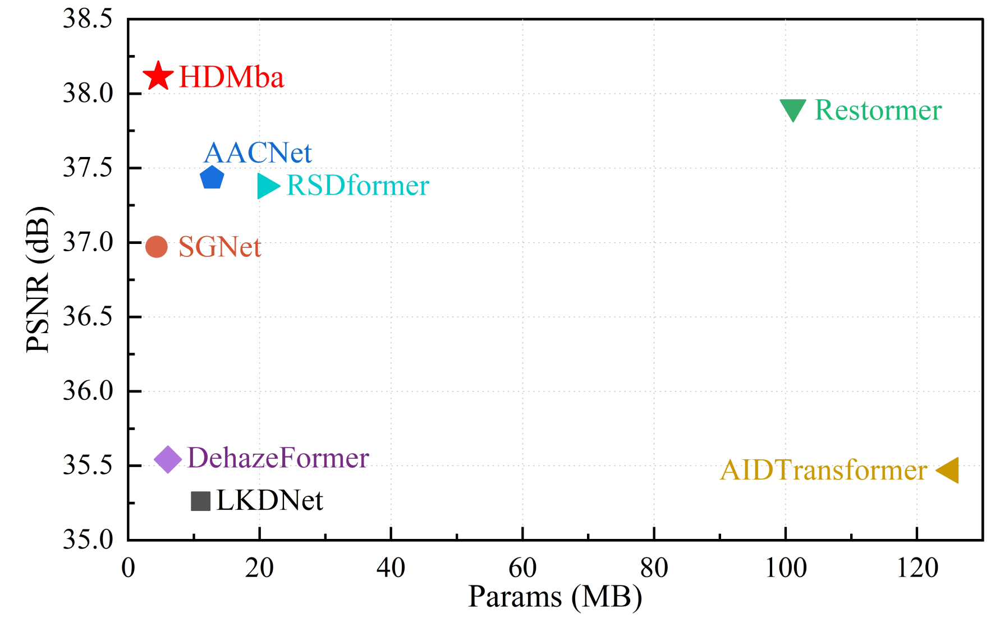

<h1>HDMba</h1>
<h3>HDMba: Hyperspectral Remote Sensing Imagery Dehazing with State Space Model</h3>

Hang Fu, [Genyun Sun](https://ocean.upc.edu.cn/2019/1107/c15434a224792/page.htm), Yinhe Li, [Jinchang Ren](https://scholar.google.com.hk/citations?user=Vsx9P-gAAAAJ&hl=zh-CN), [Aizhu Zhang](https://ocean.upc.edu.cn/2019/1108/c15434a224913/page.htm), Cheng Jing, [Pedram Ghamisi](https://www.ai4rs.com/)

#

## Abstract
Haze contamination in hyperspectral remote sensing images (HSI) can lead to spatial visibility degradation and spectral distortion. Haze in HSI exhibits spatial irregularity and inhomogeneous spectral distribution, with few dehazing networks available. Current CNN and Transformer-based dehazing meth- ods fail to balance global scene recovery, local detail retention, and computational efficiency. Inspired by the ability of Mamba to model long-range dependencies with linear complexity, we explore its potential for HSI dehazing and propose the first HSI Dehazing Mamba (HDMba) network. Specifically, we design a novel window selective scan module (WSSM) that captures local dependencies within windows and global correlations between windows by partitioning them. This approach improves the ability of conventional Mamba in local feature extraction. By modeling the local and global spectral-spatial information flow, we achieve a comprehensive analysis of hazy regions. The DehazeMamba layer (DML), constructed by WSSM, and residual DehazeMamba (RDM) blocks, composed of DMLs, are the core components of the HDMba framework. These components effec- tively characterize the complex distribution of haze in HSIs, aid- ing in scene reconstruction and dehazing. Experimental results on the Gaofen-5 HSI dataset demonstrate that HDMba outperforms other state-of-the-art methods in dehazing performance.

## Datasets

HyperDehazing: It will be available at https://github.com/RsAI-lab/HyperDehazing

HDD: Available from ([Paper](https://ieeexplore.ieee.org/document/9511329))

## Other dehazing methods

SG-Net:([Code](https://github.com/SZU-AdvTech-2022/158-A-Spectral-Grouping-based-Deep-Learning-Model-for-Haze-Removal-of-Hyperspectral-Images))

AACNet: ([Code](http://www.jiasen.tech/papers/))

DehazeFormer:([Code](https://github.com/IDKiro/DehazeFormer))

AIDFormer:([Code](https://github.com/AshutoshKulkarni4998/AIDTransformer))

RSDformer:([Code](https://github.com/MingTian99/RSDformer))

## Acknowledgement
This project is based on FFANet ([code](https://github.com/zhilin007/FFA-Net)). Thanks for their wonderful works.

